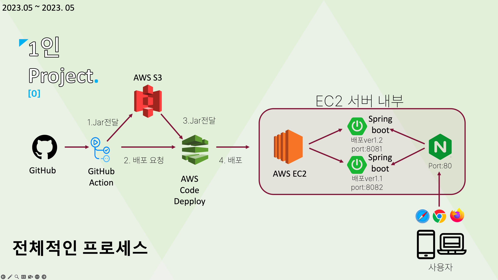

# 🔥 [프로젝트 확인](http://ec2-43-200-120-235.ap-northeast-2.compute.amazonaws.com)

## 1. 😁 서비스 소개
 소개할 기능: 관리자모드 · 유저모드 \
 사용자 제어 가능한 게시판 CRUD, 댓글 CRUD \
 좋아요 + 조회수에 기반한 랭킹 기능 \

## 2. 👬 팀원 소개
* [재강](https://github.com/JaeKang20)
**🔥1인 프로젝트**

What did I do

■ 프론트·백엔드 기술환경 세팅 및 전체 기능 구현

What did I concern about

■ Restful API를 사용한 백엔드 간의 데이터 송수신\
■ MVC 패턴을 잘지키면서 코딩했는가?\
■ 사용자별 권한 관리가 잘 되어 있는가? 
    (관리자/유저)\
■ 조건 검색별 출력되는 우선 순위를 지켰는가?\
■ 버전을 어떻게 구분하여 관리할 것인가?

What did you want to do

■ 웹서비스의 배포 모든 과정을 경험해보며 서버 인프라 지식을 익힌다.\
■ 웹서비스를 운영해보고 개발 지식을 동원하여 개선해본다. 

## 3. 💻 핵심 기능

- 회원 기능\
·회원가입,로그인 기능

- 게시글 기능\
·게시글 CRUD\
·게시글 검색 기능 (제목, 내용, 글쓴이)\
·게시글 등록 날짜 확인 가능\
·게시글 좋아요 기능\
·게시글 조회수 기능\
·게시글 페이지 기능\
·게시글 조회수 기능

- 관리자 기능\
·관리자 공지 기능\
·사용 규정 위반 포스팅 및 댓글 삭제 기능\
·관리자 페이지 (TOP 10 게시글 확인)

- 신고센터 운영\
· 신고 & 모니터링 기능

-  댓글 기능\
· 댓글 CRUD 기능\
· 댓글 수정 권한은 글쓴이만 가능\
· 댓글 삭제 권한은 글쓴이와 관리자만 가능
   

## 4. 🏬 프로젝트 구조

## 5. 🎮 기술 스택

- Spring Boot
- Spring Data JPA
- DB: MySQL
- html
- JS
- BootStrap
- AWS EC2, RDS, S3, CodeDeploy
- Github Actions
- Enginx

## 6. ✏️ 추가 정보
- [이메일 보내기](mailto:chkswordk123@naver.com)
- [공부 기록 블로그](https://keyboardwarrior.tistory.com/)